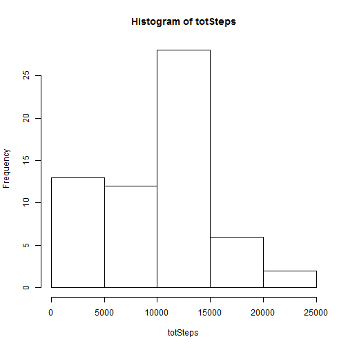
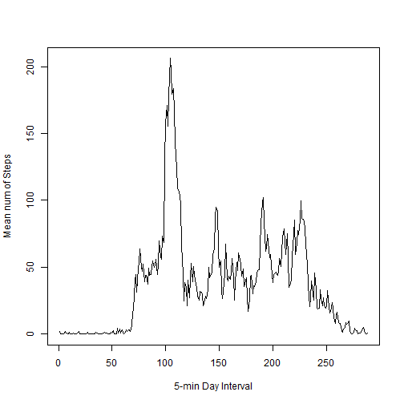
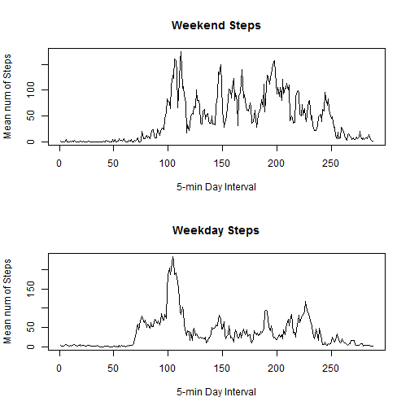

Reproducible Research - Course Project 1
========================================

It is now possible to collect a large amount of data about personal movement using activity monitoring devices such as a Fitbit, Nike Fuelband, or Jawbone Up. These type of devices are part of the "quantified self" movement - a group of enthusiasts who take measurements about themselves regularly to improve their health, to find patterns in their behavior, or because they are tech geeks. But these data remain under-utilized both because the raw data are hard to obtain and there is a lack of statistical methods and software for processing and interpreting the data.

This assignment makes use of data from a personal activity monitoring device. This device collects data at 5 minute intervals through out the day. The data consists of two months of data from an anonymous individual collected during the months of October and November, 2012 and include the number of steps taken in 5 minute intervals each day.


##Step 0: Load the data.
Assumption:  The data file is in the current working directory


```r
activity <- read.csv("activity.csv")
tail(activity)
```

```
##       steps       date interval
## 17563    NA 2012-11-30     2330
## 17564    NA 2012-11-30     2335
## 17565    NA 2012-11-30     2340
## 17566    NA 2012-11-30     2345
## 17567    NA 2012-11-30     2350
## 17568    NA 2012-11-30     2355
```

```r
options(scipen = 999) ## to minmize scientific notation for numbers
```
NOTE:  Only first few rows shown

##Question 1: What is mean total number of steps taken per day?

Method:  
Split data into groups by day.  
For each group, compute the total number of steps.  
Compute the mean and median overall, then create histogram of total steps per day.  


```r
byDay <- split(activity, activity$date)
totSteps <- sapply(byDay, function(x) { sum(x$steps, na.rm = TRUE); } )
meanTotSteps <- mean(totSteps)
medianTotSteps <- median(totSteps)
hist(totSteps)
```



Mean total number of steps taken per day: 9354.2295082.  
Median total number of steps taken per day: 10395

## Question 2: What is the average daily activity pattern?

Method:  
Split data into groups by 5-min intervals.  
For each group, compute the mean number of steps.  
Create a time series plot of the mean number of steps per 5-minute interval in a day.  


```r
byInterval <- split(activity, activity$interval)
meanStepsByInterval <- sapply(byInterval, function(x) { mean(x$steps, na.rm = TRUE)})
plot(meanStepsByInterval, type = 'l', xlab = "5-min Day Interval", ylab = "Mean num of Steps")
```



##Question 3: Imputing missing values

###Number of NAs

Missing values are identified in data with the symbol NA.  The below code counts the number of rows with NAs.


```r
nas <- activity[is.na(activity$steps), ]
numNAs <- nrow(nas)
```
The number of rows with NAs is 2304.  

### Replacing NAs with imputed value

Method:  Will replace each NA with the mean value for that 5 minute interval  


```r
activityNoNAs <- activity
activityNoNAs$steps <- ifelse(is.na(activityNoNAs$steps), meanStepsByInterval[activityNoNAs$interval], activityNoNAs$steps)
```
Note: No effort was made to make the number of steps replacing NAs a whole number.  

## Redoing histogram, mean, and median calculations


```r
byDay <- split(activityNoNAs, activityNoNAs$date)
totSteps <- sapply(byDay, function(x) { sum(x$steps, na.rm = TRUE); } )
meanTotSteps <- mean(totSteps)
medianTotSteps <- median(totSteps)
hist(totSteps)
```


Mean total number of steps taken per day: 9545.5143829.  
Median total number of steps taken per day: 10395

#### Do these values differ from the estimates from the first part of the assignment? 
The mean increased by approx 200 steps but the median stayed the same.

####What is the impact of imputing missing data on the estimates of the total daily number of steps?
By replacing NAs with positive values, the total number of steps per day for days with NAs would increase causing the mean to increase but did not move from lower 50% to upper 50% - or not enough moved - to change the median value.

##Question 4: Are there differences in activity patterns between weekdays and weekends?

#### Construct a data step with an additional factor column stating if Weekday or Weekend


```r
dayType <- sapply(activityNoNAs$date, function (x) { ifelse(as.POSIXlt(x)$wday == 0 || as.POSIXlt(x)$wday == 6, "Weekend", "Weekday") })
activityNoNAs <- cbind(activityNoNAs, dayType)

byDayType <- split(activityNoNAs, activityNoNAs$dayType)

weekend = byDayType[[2]]
byInterval <- split(weekend, weekend$interval)
weekendStepsByInterval <- sapply(byInterval, function(x) { mean(x$steps, na.rm = TRUE)})

weekday = byDayType[[1]]
byInterval <- split(weekday, weekday$interval)
weekdayStepsByInterval <- sapply(byInterval, function(x) { mean(x$steps, na.rm = TRUE)})

par(mfrow = c(2,1))
plot(weekendStepsByInterval, type = 'l', main = "Weekend Steps", xlab = "5-min Day Interval", ylab = "Mean num of Steps")
plot(weekdayStepsByInterval, type = 'l', main = "Weekday Steps", xlab = "5-min Day Interval", ylab = "Mean num of Steps")
```


